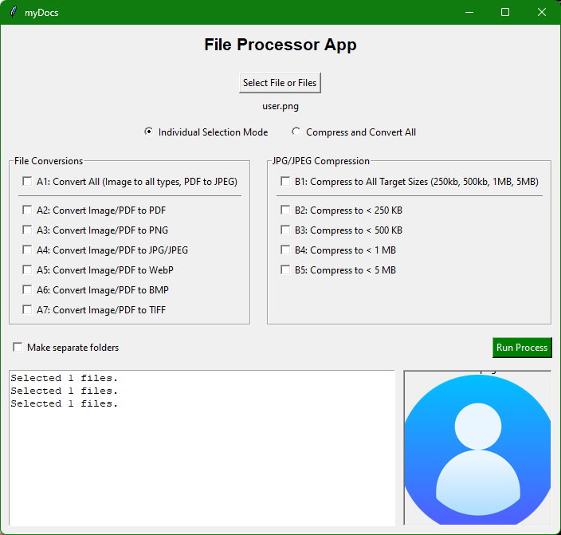

# 🚀 myDocs


Have you ever found yourself applying for a college, filling an application, or making an account on some website and when asked to upload a document, after finally finding it and trying to upload it only to get the message, **This Format is not supported** or **file size exceeds**, then found yourself in the midst of online file converters and compression web apps, ending up uploading your document and finally have it converted but when you start download, they ask you for an account and it all left you feeling tired and frustrated?

Well, then this app is for you. It is a simple, powerful and intuitive desktop application built with **Python (Tkinter/Pillow)** for batch file conversion, image compression, and smart file organization. Just select a file and select your desired extension and voila!

and the cherry on top, `No ads!`

---

## 📚 Table of Contents

- [Features](#-features)
  - [File Conversion (Group A)](#file-conversion-group-a)
  - [Image Compression (Group B)](#image-compression-group-b)
  - [Output Organization](#output-organization)
  - [Quick Modes](#quick-modes)
- [Screenshots](#screenshot)
- [Installation and Download](#installation-and-download)
  - [Option 1: Standalone Executable](#option-1-standalone-executable-recommended)
  - [Option 2: Run from Source](#option-2-run-from-source)
- [Usage Instructions](#usage-instructions)
- [License](#license)

---

## ✨ Features

### File Conversion (Group A)

The app uses **Pillow** and **pdf2image** to convert between common image formats and PDF documents.

| Option | Function |
|--------|----------|
| **A1** | Convert All: Images → all supported image types, PDFs → JPEG |
| **A2–A7** | Single-target conversions (to PDF, PNG, JPG, WebP, BMP, TIFF) |

---

### Image Compression (Group B)

Uses iterative JPEG quality adjustment to meet precise file size goals.

| Option | Target Size | Optimization |
|--------|-------------|--------------|
| **B1** | Compress All | Runs all target sizes below; skips sizes already smaller than original |
| **B2–B5** | Single-target compression | Example: If target is **< 1 MB**, and file is **800 KB**, it is skipped |

---

### Output Organization

The output directory (`myDocs/`) is created relative to the application's location.

| Mode | "Make separate folders" | Output Structure |
|------|--------------------------|------------------|
| **Standard** | OFF | `myDocs/` |
| **Separate** | ON | `myDocs/OUTPUT_EXTENSION/` |

---

### Quick Modes

- **Compress and Convert All** automatically selects **A1** and **B1**.
- **Live Preview Pane** shows the first selected file.

---

## Screenshot



---

## Installation and Download

### Option 1: Standalone Executable (Recommended)

1. Go to [Releases Page](https://github.com/def-fun7/myDocs/releases)
2. Download **myDocs.zip**.
3. Unzip and run **myDocs.exe**.

---

### Option 2: Run from Source

#### Clone and Setup

```bash
git clone https://github.com/def-fun7/myDocs.git
cd myDocs
pip install -r requirements.txt
```

#### Run

```bash
python main.py
```

---

## Usage Instructions

1. Select files.
2. Choose mode.
3. Configure output.
4. Select tasks.
5. Run the process.
6. Review output and logs.

---

## License

Licensed under the **MIT License**.
